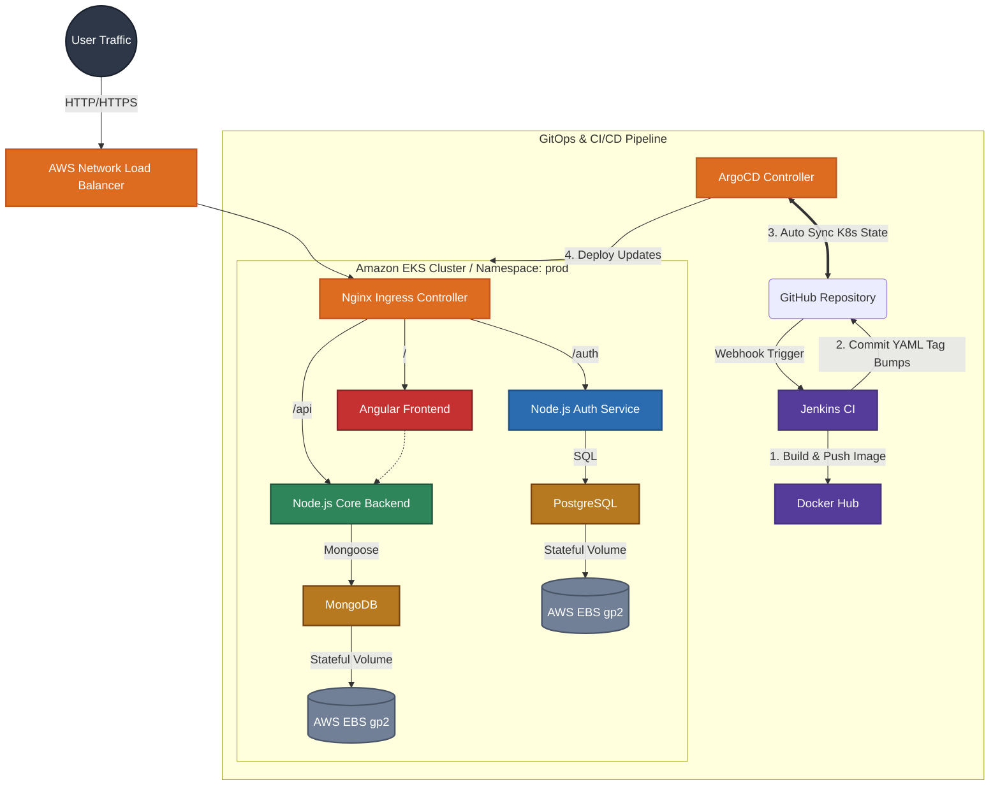

<div align="center">


# Enterprise SaaS Microservices Architecture with GitOps
**Production-Grade Kubernetes Infrastructure on AWS EKS**

<br />

<p align="center">
  
  
  
  
  
  
</p>

[Architecture & Design](#architecture--infrastructure) | [GitOps Pipeline](#continuous-delivery--gitops) | [Scalability & Security](#security--scalability) | [Deployment Guide](#deployment--installation)

</div>

<br />

> **Overview:** This repository demonstrates a highly scalable, cloud-native DevOps infrastructure. The underlying application is a decoupled Enterprise SaaS platform, but the core focus of this project is the zero-trust microservice architecture, Jenkins CI/CD automation, and pull-based GitOps deployment strategy running on Amazon EKS.

---

## ARCHITECTURE & INFRASTRUCTURE

The environment is robustly defined using declarative Kubernetes manifests and designed for high availability, self-healing workloads, and zero-downtime rolling updates.



### Key Technical Implementations

**AWS Ingress & Load Balancing**  
Traffic is marshaled into the cluster using an **AWS Network Load Balancer (NLB)**. At the ingress level, advanced regex rewriting (`nginx.ingress.kubernetes.io/rewrite-target`) actively segments traffic across independent monolithic boundaries (/api vs /auth).

**Microservice Segmentation**  
The backend is aggressively decoupled. Authentication and core business logic run as entirely separate pods, connecting to independent persistent databases (PostgreSQL and MongoDB) to simulate enterprise multi-database stateful deployments.

**Declarative Configuration Management**  
Hardcoded tokens are eliminated. Infrastructure relies on Kubernetes `ConfigMap` resources for dynamic variable injection at runtime, while sensitive data is Base64 encoded and managed via isolated `Secret` resources.

---

## CONTINUOUS DELIVERY & GITOPS

This infrastructure abandons imperative provisioning commands (`kubectl apply`) in favor of a strictly pull-based GitOps paradigm to ensure the active cluster state perfectly mirrors the repository.

1. **Continuous Integration (Jenkins)**  
   Upon code merge, Jenkins triggers a declarative pipeline (`Jenkinsfile1`). It builds Docker images tagged dynamically via `$BUILD_NUMBER` and pushes the updated artifacts to the registry.
2. **Automated Manifest Updates**  
   Jenkins securely authenticates against GitHub, identifies the target deployment files (`k8s/`), parses and modifies the image tags, and pushes a commit back to the `main` branch, intentionally bypassing further CI loops.
3. **Continuous Deployment (ArgoCD)**  
   ArgoCD, living inside the EKS cluster, acts as the synchronization controller. Detecting the drift caused by Jenkins, it automatically provisions a rolling update—ensuring zero downtime while pulling the newly tagged images from Docker Hub.

---

## SECURITY & SCALABILITY

A production environment must anticipate failure. This cluster relies heavily on dynamic scaling and self-healing configurations.

* **Horizontal Pod Autoscaling (HPA)**  
  Tethered to the Kubernetes Metrics Server, pods are strictly monitored. If CPU utilization exceeds 60% or Memory breaches 70%, the HPA dynamically provisions new replicas to absorb load spikes, gracefully scaling down when traffic subsides.
* **Self-Healing Infrastructure**  
  Every container utilizes aggressive `livenessProbe` and `readinessProbe` definitions. Traffic is halted globally at the ingress controller until a pod successfully returns an HTTP 200 health check, preventing cascading failures.
* **Resource Quotas & Limits**  
  To prevent rogue memory leaks from crashing underlying AWS EC2 nodes, strict CPU and Memory requests and limits are enforced globally across the `prod` namespace.

---

## MONITORING & OBSERVABILITY

A production cluster is incomplete without deep visibility. This infrastructure includes a full-stack observability suite powered by the **kube-prometheus-stack**.

*   **Prometheus**: Aggregates time-series metrics from every node and pod in the cluster (CPU, Memory, Disk IO, Network).
*   **Grafana**: Provides interactive, high-fidelity dashboards to visualize cluster health and application performance.
*   **Service Monitoring**: Automatically discovers and scrapes metrics from any service with a `ServiceMonitor` definition.

### Accessing the Dashboards

The monitoring stack is managed via GitOps (ArgoCD) in the `monitoring` namespace.

1.  **Deploy the Monitoring Stack**:
    ```bash
    kubectl apply -f k8s/monitoring-stack.yaml
    ```
2.  **Login to Grafana**:
    Port-forward the Grafana service to your local machine:
    ```bash
    kubectl port-forward svc/monitoring-stack-grafana -n monitoring 3000:80
    ```
    *   **URL**: `http://localhost:3000`
    *   **Default Credentials**: `admin` / `admin`

---

## DEPLOYMENT & INSTALLATION

To recreate this environment, standard deployment relies entirely on ArgoCD mapping the `/k8s` directory into your cluster.

### 1. Provision the Initial Ingress
Apply the AWS Nginx Ingress Controller to generate the Network Load Balancer:
```bash
kubectl apply -f https://raw.githubusercontent.com/kubernetes/ingress-nginx/controller-v1.9.4/deploy/static/provider/aws/deploy.yaml
```

### 2. Configure ArgoCD
Install the core ArgoCD control plane within the cluster:
```bash
kubectl create namespace argocd
kubectl apply -n argocd -f https://raw.githubusercontent.com/argoproj/argo-cd/stable/manifests/install.yaml --server-side --force-conflicts
```

### 3. Access the ArgoCD Dashboard
To securely access the ArgoCD Web UI without exposing it to the public internet, use Kubernetes port-forwarding:
```bash
kubectl port-forward svc/argocd-server -n argocd 8080:443
```
* **URL:** `https://localhost:8080`
* **Username:** `admin`
* **Password:** Retrieve the automatically generated password using:
```bash
kubectl -n argocd get secret argocd-initial-admin-secret -o jsonpath="{.data.password}" | base64 -d
```

### 4. Deploy the Platform
Apply the base ArgoCD tracking manifest. ArgoCD will instantly detect the repository and construct the required `prod` namespace, databases, deployments, and services.
```bash
kubectl apply -f k8s/argocd-app.yaml
```

*Note for local validation:* If deploying without a Kubernetes cluster, a raw `docker-compose.yml` file is provided for isolated rapid testing: `docker-compose up -d --build`.

<br />

<div align="center">
  <b>Designed for the Cloud. Built for Scale.</b>
</div>
