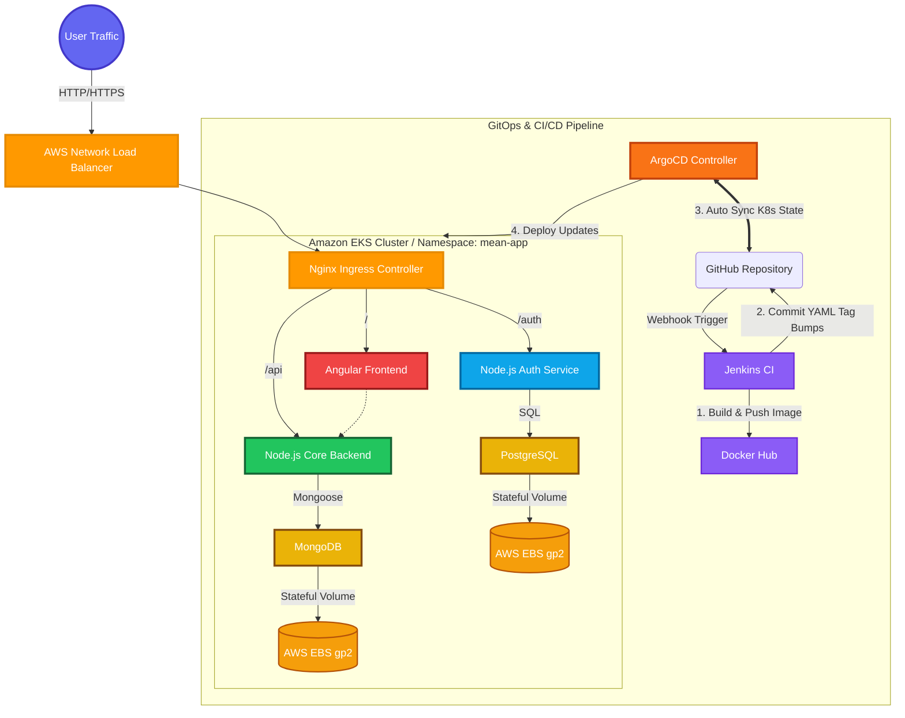

<div align="center">


# MEAN Microservices Architecture with GitOps  
**Enterprise-Grade Kubernetes Infrastructure on AWS EKS using Jenkins, ArgoCD, and Nginx Ingress.**

<p align="center">
  
  
  
  
  
  
</p>

[Architecture & Design](#-enterprise-devops--kubernetes) • [GitOps CI/CD](#-automated-gitops-pipeline-jenkins--argocd) • [Security & Autoscaling](#-security--autoscaling) • [Installation](#-getting-started)

</div>

---

## About The Project

This repository serves as a showcase of modern **DevOps, Cloud-Native architecture, and GitOps practices**. While the core application is a polished, Notion-inspired MEAN stack journaling platform, the true focus of this project is the robust, highly scalable infrastructure orchestrating it.

Built on **Amazon Elastic Kubernetes Service (EKS)**, the platform implements a zero-trust microservice architecture, true GitOps continuous delivery via **ArgoCD**, dynamic CI pipelines via **Jenkins**, and traffic routing via an **AWS Network Load Balancer (NLB)** managed by Nginx Ingress.

---

## Enterprise DevOps & Kubernetes Architecture

The environment is entirely declaratively defined in the `/k8s` directory and architected for high availability, self-healing, and zero-downtime rolling updates.



### Infrastructure Highlights
* **Nginx Ingress on AWS EKS:** An AWS Network Load Balancer (NLB) provisions external IPs automatically. Advanced Regex rewriting at the ingress level (`nginx.ingress.kubernetes.io/rewrite-target`) seamlessly routes traffic to independent microservices (`/api` vs `/auth`).
* **Microservices Segmentation:** Monoliths are broken down. The core backend and authentication backend are decoupled, utilizing MongoDB and PostgreSQL respectively to demonstrate multi-database stateful deployments.
* **Declarative Config & Secrets:** Environment variables are strictly maintained through K8s `ConfigMap` resources, avoiding hard-coded variables inside Docker images. Sensitive credentials are Base64 encoded into `Secret` resources.

---

## Automated GitOps Pipeline (Jenkins + ArgoCD)

This infrastructure aggressively abandons imperative `kubectl apply` commands in favor of a true **Pull-based GitOps approach**. 

1. **Continuous Integration (Jenkins):** Upon a code merge, Jenkins executes a declarative pipeline (`Jenkinsfile1`). It builds Docker images dynamically tagged with the `$BUILD_NUMBER` and pushes them to Docker Hub.
2. **Manifest Updation:** Jenkins securely authenticates back into the GitHub repository, sed-replaces the old image tags in the specific Kubernetes deployment YAMLs (`k8s/`), and commits the new tags bypassing the CI trigger.
3. **Continuous Deployment (ArgoCD):** Deployed inside the EKS cluster, ArgoCD continuously monitors the `main` branch. The moment Jenkins pushes the manifest update, ArgoCD catches the drift and automatically initiates a zero-downtime rolling update to synchronize the live cluster state with the Git repository.

---

## Security & Autoscaling

- **Horizontal Pod Autoscaling (HPA):** Powered by the Kubernetes Metrics Server. If CPU spikes over 60% or Memory over 70%, the HPA automatically provisions new replicas (scaling from 1 to 5 pods) to absorb traffic spikes, scaling back down when load subsides.
- **Self-Healing Infrastructure:** Rigorous HTTP `livenessProbe` and `readinessProbe` blocks ensure traffic isn't routed to malfunctioning or starting containers.
- **Zero-Trust Network Limits:** Pods utilize precise Resource Requests and Limits (e.g. CPU `100m` request, `500m` limit) to prevent rogue memory leaks from crashing the host EKS nodes.

---

## Getting Started

Deploying the entire infrastructure can be done via ArgoCD.

### 1. Provision the Cluster & Ingress
Ensure your Kubernetes core components (like the AWS Nginx Ingress Controller) are installed:
```bash
# Install Ingress for AWS EKS
kubectl apply -f https://raw.githubusercontent.com/kubernetes/ingress-nginx/controller-v1.9.4/deploy/static/provider/aws/deploy.yaml
```

### 2. Install ArgoCD
```bash
kubectl create namespace argocd
kubectl apply -n argocd -f https://raw.githubusercontent.com/argoproj/argo-cd/stable/manifests/install.yaml --server-side --force-conflicts
```

### 3. Deploy the Application
Apply the overarching ArgoCD Application manifest. ArgoCD will instantly construct the cluster matching the GitHub `k8s/` directory.
```bash
kubectl apply -f k8s/argocd-app.yaml
```

### Option 2: Docker Compose (Local Testing)
For rapid local validation without Kubernetes overhead:
```bash
docker-compose up -d --build
```

---

<div align="center">
  <b>Architected for the Cloud, Built for Scale.</b><br><br>
</div>
